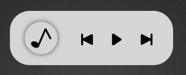
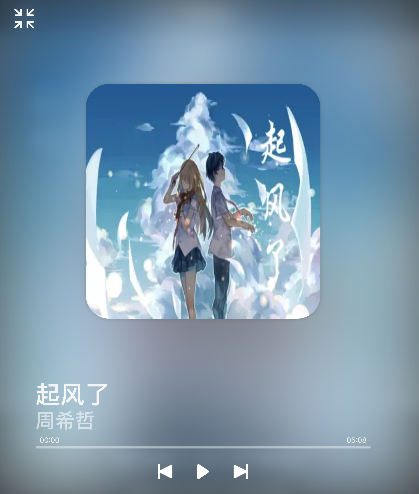
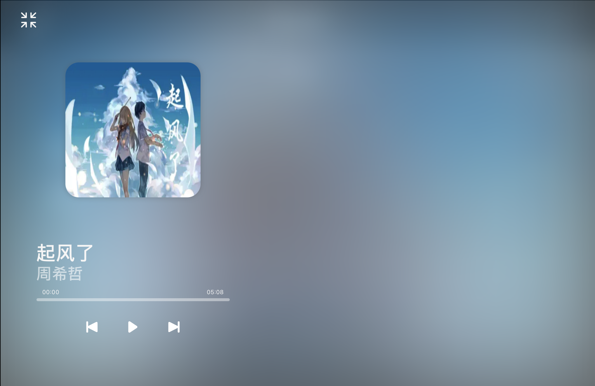
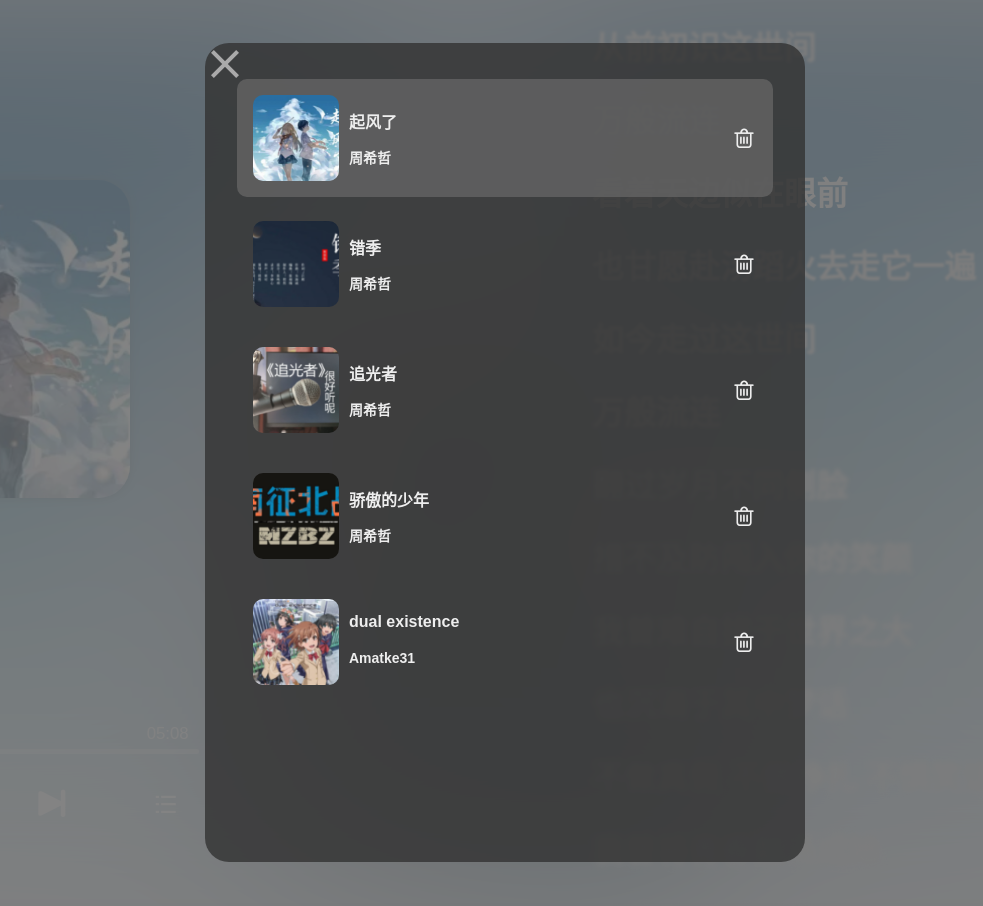

# vue-MamicPlayer

[](https://www.npmjs.com/package/vue-mamicplayer)
[](https://github.com/Nexmamic/vue-mamicplayer/blob/master/LICENSE)
[](https://www.npmjs.com/package/vue-mamicplayer)

[English doc](https://github.com/Nexmamic/vue-mamicplayer/#readme)

## Introduction

MamicPlayer是Nexmamic的悬浮播放器  
他有全屏和悬浮两种模式

([Nexmamic](https://www.nexmamic.com) 是国内一个音乐创作分享平台)

让我们来看看吧:









## Install

```shell
yarn add vue-mamicplayer
#OR
npm install vue-mamicplayer
```

### Vue

向 `main.js` 增加代码

```javascript
import MamicPlayer from 'vue-mamicplayer'

const Player = {
    install(Vue) {
        Vue.component('Player', MamicPlayer)
        Vue.prototype.Player = {
            playlist: [],
            updatePlaylist(data) {
                this.playlist = data
            }
        }
    }
}
Vue.use(Player)
```

### Nuxt

创建一个插件文件给MamicPlayer,  `plugins/MamicPlayer.js` 内容如下:

```javascript
import Vue from 'vue'
import MamicPlayer from 'vue-mamicplayer'

const Player = {
    install(Vue) {
        Vue.component('Player', MamicPlayer)
        // This is added to facilitate the use of other page
        Vue.prototype.Player = {
            playlist: [],
            updatePlaylist(data) {
                this.playlist = data
            }
        }
    }
}
Vue.use(Player)
```

安装之后，更新你的 `nuxt.config.js` 从而在构建中包含 MamicPlayer 模块。

```js
{
  plugins: [
    { src: '@/plugins/MamicPlayer', ssr: false }
  ]
}
```

## Usage

```vue
<template>
  ...
  <Player />
</template>
```

## Config

参数:

| 名称                | 类型     | 默认值                    | 说明                                   |
| ------------------ | ------- | ------------------------ | ------------------------------------- |
| defaultCover       | String  |                          | 如果播放列表为空，则显示该图片              |
| playlist           | Array   |                          | 播放列表                                |
| localplw           | Boolean | true                     | 是否将要播放的音乐保存到本地存储            |
| dse                | Boolean | false                    | 是否禁用背景特效                         |
| supportControlList | Boolean | false                    | 是否支持删除列表中的歌，对应事件deleteMusic |
| noLyricText        | String  | No lyrics, please enjoy  | 没有歌词时显示的文本                      |

事件:

| 名称         | 返回值         | 说明                                 |
| ----------- | ------------- | ------------------------------------ |
| onMusic     | 音乐信息        | 当播放器全屏显示时，用户单击音乐名称 |
| onArtist    | 音乐信息        | 当播放器全屏显示时，用户单击艺人名称 |
| updateData  | 音乐信息        | 请求刷新音乐列表                     |
| deleteMusic | 在列表中的第几项 | 请求删除音乐列表第n个音乐       |

播放列表格式:

```json
[
  {
    //艺人名字
    "artist": "Amatke31",
    //歌曲封面url
    "cover": "/img/1.png",
    //音乐名
    "name": "dual existence(remox)",
    //音乐文件url
    "source": "/music/1.wav",
    //歌词文件url(可选)
    "lyric": "/lyric/1.lrc",
    //你也可以加点其他的，这在很多事件中非常有用
    //这不会影响到Player
    //比如音乐介绍地址
    "music_url": "https://www.nexmamic.com/Music/4"
  },
  {
    "artist": "Zhou",
    "cover": "/img/2.png",
    "name": "He's a pirate",
    "source": "/music/2.wav",
    "artist_url": "https://www.nexmamic.com/Users/1"
  }
]
```

deleteMusic事件:

将以下代码放入布局vue中

```vue
<template>
  ...
  <Player
    ...
    :playlist="playlist"
    :supportControlList="true"
    @deleteMusic="deleteMusic"
    ...
  />
  ...
</template>
export default {
  ...
  methods: {
    ...
    deleteMusic: function (num) {
      this.Player.playlist.splice(num,1)
      this.playlist = this.Player.playlist
    },
    ...
  }
}
```

## example

接下来，我们将展示一个更完整的项目

app.vue

```vue
<template>
  ...
  <Player
      defaultCover="/favicon.ico"
      :playlist="playlist"
      :localplw="true"
      :supportControlList="true"
      @pressMusicName="goMusic"
      @pressArtistName="goArtist"
      @updateData="update"
      @deleteMusic="deleteMusic"
    />
</template>
<script>
export default {
  data: function () {
    return {
      playlist: [],
    };
  },
  beforeMount() {
    // 在本地创建播放列表
    // format: [1,2,3]
    if (localStorage.getItem("Player_list")) {
    } else {
      localStorage.setItem("Player_list", "[]");
    }
  },
  mounted() {
    // 从本地存储获取播放列表
    var playlist_num = JSON.parse(localStorage.getItem("Player_list"));
    var playlist = new Array();
    var getPlayerListInfo = [];
    if (playlist_num.length) {
      playlist_num.forEach(async (item, index) => {
        getPlayerListInfo[index] = new Promise((resolve) => {
          // 请求API
          this.$axios({
            url: "/Music/info",
            method: "get",
            params: {
              id: item,
            },
          }).then((res) => {
            res = res.data;
            var info = new Object();
            info.name = res.music_name;
            info.artist = res.music_artistname;
            info.source = "/Music/" + res.music_id + "/" + res.file_music;
            info.cover = "/MusicCover/" + res.music_id + "/" + res.file_cover;
            info.lyric = "/Lyric/" + res.music_id + "/" + res.file_lyric;
            info.artist_url = "/Users/" + res.music_artist;
            info.music_url = "/Music/" + res.music_id;
            resolve(info);
          });
        });
      });
      Promise.all(getPlayerListInfo).then((message) => {
        playlist = message;
        // 更改全局变量以便于访问
        this.Player.updatePlaylist(playlist);
        // 更改播放列表
        this.playlist = this.Player.playlist;
      });
    }
  },
  methods: {
    goMusic: function (id) {
      // 转到歌曲页
      this.$router.push(id.music_url);
    },
    goArtist: function (id) {
      // 转到艺人页
      this.$router.push(id.artist_url);
    },
    update: function () {
      // 更新数据
      if (this.Player.playlist.length) {
        this.playlist = this.Player.playlist;
      }
    },
    deleteMusic: function (num) {
      this.Player.playlist.splice(num,1)
      this.playlist = this.Player.playlist
      //储存到localStorage
      var locallist = new Array();
      for(var i = 0; this.playlist[i]; i++){
        locallist[i] = this.playlist[i].id
      }
      localStorage.setItem("Player_list", JSON.stringify(locallist));
    },
  }
}
</script>
```

在其他页面中

例如musicPage.vue

```vue
<template>
  ...
  <div v-on:click="addToList()">
    增加到播放列表
  </div>
  ...
</template>
<script>
export default {
  ...
  methods: {
    addToList() {
      // 从本地存储获取音乐id列表
      var locallist = JSON.parse(localStorage.getItem("Player_list"));
      if (locallist.indexOf(parseInt(this.$route.params.id)) == -1) {
        var playlist = [];
        var info = {};
        info.name = this.music_name;
        info.artist = this.user_name;
        info.source = "/Music/" + this.music_id + "/" + this.source;
        info.cover = "/MusicCover/" + this.music_id + "/" + this.cover;
        info.lyric = "/Lyric/" + this.music_id + "/" + this.lyric;
        info.artist_url = "/Users/" + this.music_artist;
        info.music_url = "/Music/" + this.music_id;
        playlist = this.Player.playlist;
        playlist.push(info);
        locallist.push(parseInt(this.$route.params.id));
        // 更新到全局
        this.Player.updatePlaylist(playlist);
        // 将音乐id列表更新到localStorage
        localStorage.setItem("Player_list", JSON.stringify(locallist));
      } else {
        alert("Already in the play list!");
      }
    },
  },
  ...
}
</script>
```

## Author

MamicPlayer © Nexmamic, Released under the Apache 2.0 License
