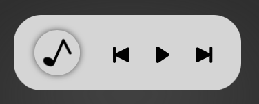
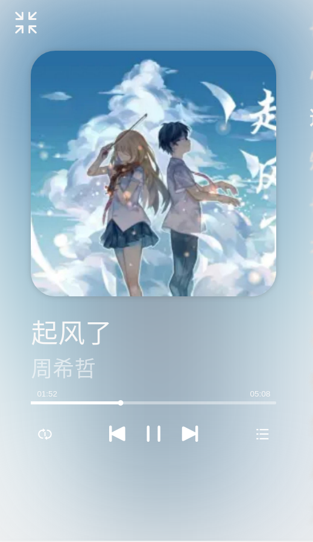
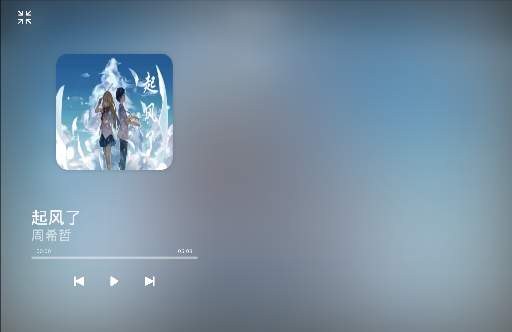

# vue-MamicPlayer

[](https://www.npmjs.com/package/vue-mamicplayer)
[](https://github.com/Nexmamic/vue-mamicplayer/blob/master/LICENSE)
[](https://www.npmjs.com/package/vue-mamicplayer)

[中文文档](https://github.com/Nexmamic/vue-mamicplayer/blob/main/README-zh.md)

## Introduction

MamicPlayer is Nexmamic platform lovely Player  
It has two modes, full screen and floating

([Nexmamic](https://www.nexmamic.com) is a music creation sharing platform in China)

### Features

- Lyrics
- Other UI
- Custom UI

Let's have a look:







## Install

```shell
yarn add vue-mamicplayer
#OR
npm install vue-mamicplayer
```

### Vue

Add code to `main.js`

```javascript
import MamicPlayer from 'vue-mamicplayer'

const Player = {
    install(Vue) {
        Vue.component('Player', MamicPlayer)
        Vue.prototype.Player = {
            playlist: [],
            updatePlaylist(data) {
                this.playlist = data
            }
        }
    }
}
Vue.use(Player)
```

### Nuxt

Create a plugin file for MamicPlayer, `plugins/MamicPlayer.js` with the below content:

```javascript
import Vue from 'vue'
import MamicPlayer from 'vue-mamicplayer'

const Player = {
    install(Vue) {
        Vue.component('Player', MamicPlayer)
        // This is added to facilitate the use of other page
        Vue.prototype.Player = {
            playlist: [],
            updatePlaylist(data) {
                this.playlist = data
            }
        }
    }
}
Vue.use(Player)
```

Once installed, update your `nuxt.config.js` file to include the Vuetify module in the build.

```js
{
  plugins: [
    { src: '@/plugins/MamicPlayer', ssr: false }
  ]
}
```

## Usage

```vue
<template>
  ...
  <Player />
</template>
```

## Config

parameter:

| Name         | type    | default | description                                         |
| ------------ | ------- | ------- | --------------------------------------------------- |
| defaultCover | String  |         | If the playlist is empty, display this picture      |
| playlist     | Array   |         | playlist                                            |
| localplw     | Boolean | true    | Whether to save the music to be played localStorage |

event:

| event name | return    | description                                                                 |
| ---------- | --------- | --------------------------------------------------------------------------- |
| onMusic    | MusicInfo | When the player is shown in full screen, the user clicks on the music name  |
| onArtist   | MusicInfo | When the player is shown in full screen, the user clicks on the artist name |
| updateData | MusicInfo | Request to refresh the music list                                           |

playlist format:

```json
[
  {
    //artist name
    "artist": "Amatke31",
    //music cover url
    "cover": "/img/1.png",
    //music name
    "name": "dual existence(remox)",
    //music source url
    "source": "/music/1.wav",
    //and other you want
    //this will not affect the Player
    //like music url?
    "music_url": "https://www.nexmamic.com/Music/4"
  },
  {
    "artist": "Zhou",
    "cover": "/img/2.png",
    "name": "He's a pirate",
    "source": "/music/2.wav",
    "artist_url": "https://www.nexmamic.com/Users/1"
  }
]
```

## example

Next, we will show a more complete project

app.vue

```vue
<template>
  ...
  <Player
      defaultCover="/favicon.ico"
      :playlist="playlist"
      :localplw="plw"
      @pressMusicName="goMusic"
      @pressArtistName="goArtist"
      @updateData="update"
    />
</template>
<script>
export default {
  data: function () {
    return {
      playlist: [],
      plw: true,
    };
  },
  beforeMount() {
    // Create a play list locally
    // format: [1,2,3]
    if (localStorage.getItem("Player_list")) {
    } else {
      localStorage.setItem("Player_list", "[]");
    }
  },
  mounted() {
    // Get playlist from localStorage
    var playlist_num = JSON.parse(localStorage.getItem("Player_list"));
    var playlist = new Array();
    var getPlayerListInfo = [];
    if (playlist_num.length) {
      playlist_num.forEach(async (item, index) => {
        getPlayerListInfo[index] = new Promise((resolve) => {
          //Request API
          this.$axios({
            url: "/Music/info",
            method: "get",
            params: {
              id: item,
            },
          }).then((res) => {
            res = res.data;
            var info = new Object();
            info.name = res.music_name;
            info.artist = res.music_artistname;
            info.source = "/Music/" + res.music_id + "/" + res.file_music;
            info.cover = "/Music/" + res.music_id + "/" + res.file_cover;
            info.artist_url = "/Users/" + res.music_artist;
            info.music_url = "/Music/" + res.music_id;
            resolve(info);
          });
        });
      });
      Promise.all(getPlayerListInfo).then((message) => {
        playlist = message;
        // Change global variables for easy access
        this.Player.updatePlaylist(playlist);
        // Change playlist
        this.playlist = this.Player.playlist;
      });
    }
  },
  methods: {
    goMusic: function (id) {
      // Go to song page
      this.$router.push(id.music_url);
    },
    goArtist: function (id) {
      // Go to artist page
      this.$router.push(id.artist_url);
    },
    update: function () {
      // refresh data
      if (this.Player.playlist.length) {
        this.playlist = this.Player.playlist;
      }
    }
  }
}
</script>
```

in other page

musicPage.vue

```vue
<template>
  ...
  <div v-on:click="addToList()">
    add to playlist
  </div>
  ...
</template>
<script>
export default {
  ...
  methods: {
    addToList() {
      // get music id list from localStorage
      var locallist = JSON.parse(localStorage.getItem("Player_list"));
      if (locallist.indexOf(parseInt(this.$route.params.id)) == -1) {
        var playlist = [];
        var info = {};
        info.name = this.music_name;
        info.artist = this.user_name;
        info.source = "/Music/" + this.music_id + "/" + this.source;
        info.cover = "/Music/" + this.music_id + "/" + this.cover;
        info.artist_url = "/Users/" + this.music_artist;
        info.music_url = "/Music/" + this.music_id;
        playlist = this.Player.playlist;
        playlist.push(info);
        locallist.push(parseInt(this.$route.params.id));
        // Update to global
        this.Player.updatePlaylist(playlist);
        // Update music id list to localStorage
        localStorage.setItem("Player_list", JSON.stringify(locallist));
      } else {
        alert("Already in the play list!");
      }
    },
  },
  ...
}
</script>
```

## Author

MamicPlayer © Nexmamic, Released under the Apache 2.0 License
